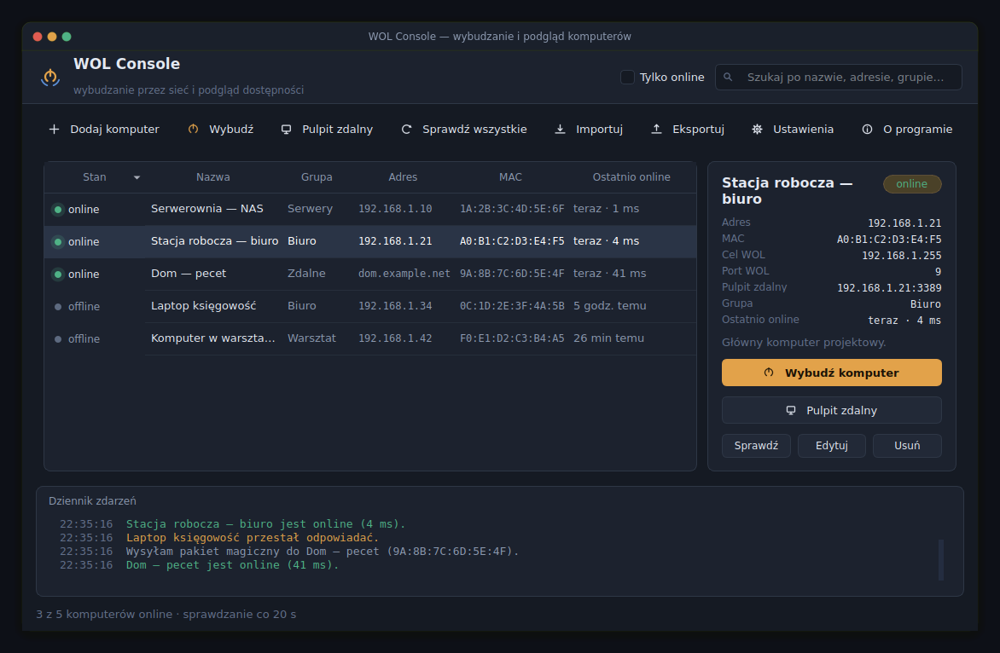
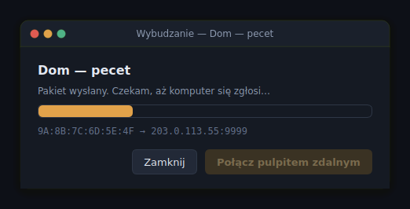
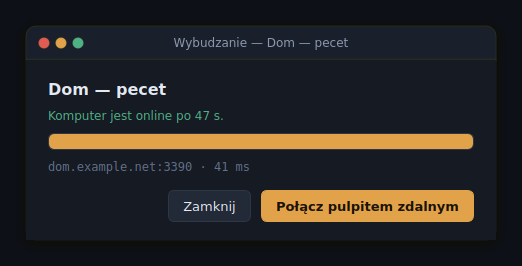
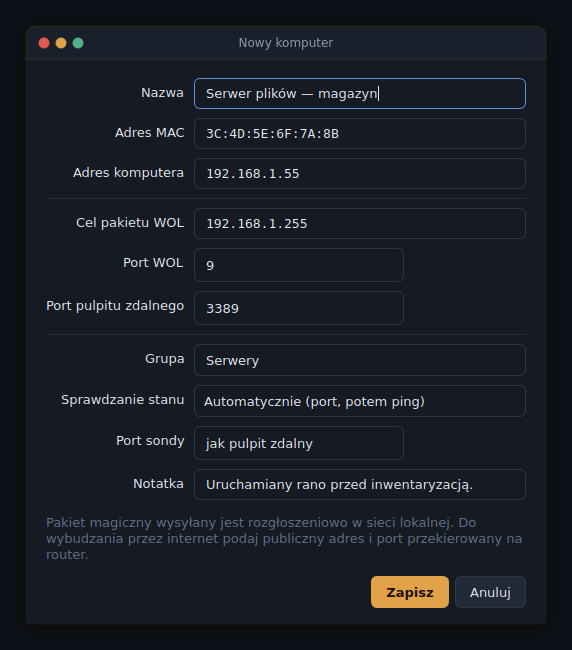
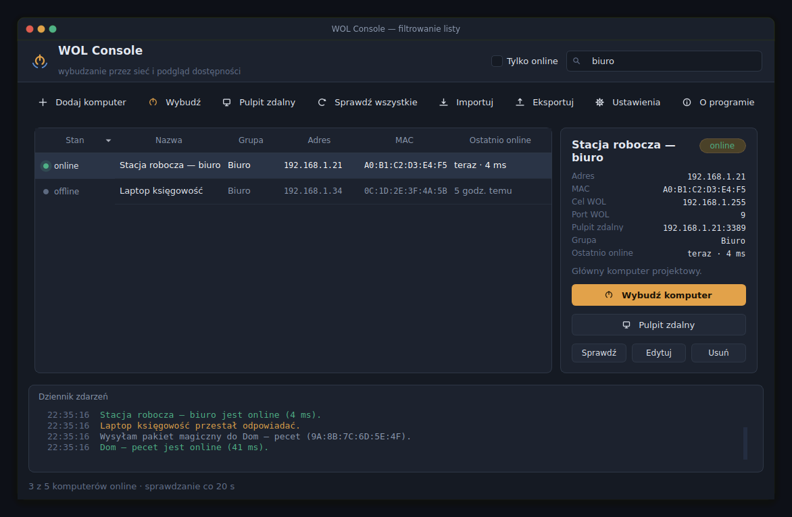
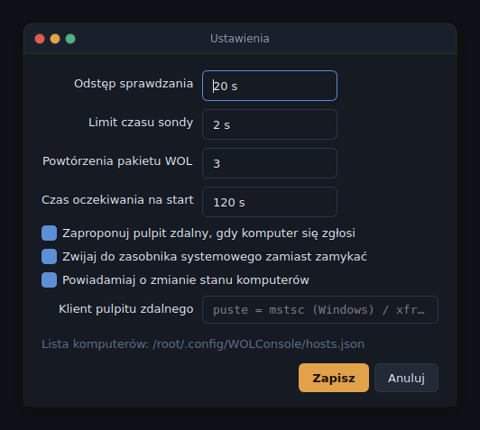
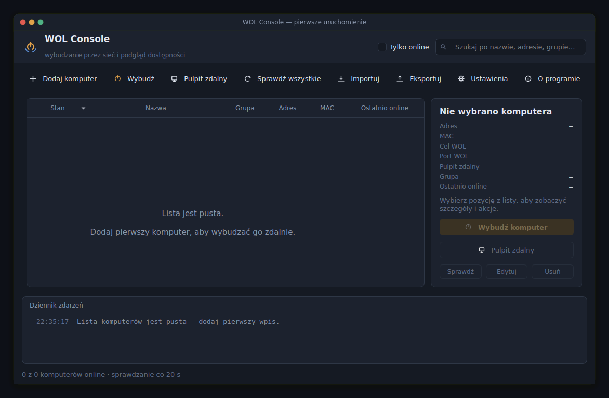

<div align="center">

# WOL Console

**Wybudzanie komputerów przez Wake-on-LAN, podgląd ich dostępności i szybkie połączenie pulpitem zdalnym — w jednym oknie.**

[](https://www.python.org/)
[-41CD52?logo=qt&logoColor=white)](https://doc.qt.io/qtforpython/)
[](#instalacja)
[](LICENSE)



</div>

---

## Spis treści

- [Do czego to służy](#do-czego-to-służy)
- [Funkcje](#funkcje)
- [Zrzuty ekranu](#zrzuty-ekranu)
- [Instalacja](#instalacja)
- [Pierwsze uruchomienie](#pierwsze-uruchomienie)
- [Jak to działa](#jak-to-działa)
- [Skróty klawiszowe](#skróty-klawiszowe)
- [Konfiguracja](#konfiguracja)
- [Budowanie pliku .exe](#budowanie-pliku-exe)
- [Wymagania po stronie komputera docelowego](#wymagania-po-stronie-komputera-docelowego)
- [Rozwiązywanie problemów](#rozwiązywanie-problemów)
- [Plany rozwoju](#plany-rozwoju)
- [Autor i licencja](#autor-i-licencja)

---

## Do czego to służy

Komputery w biurze, warsztacie czy w domu bywają wyłączone wtedy, kiedy są potrzebne.
WOL Console wysyła do nich pakiet magiczny (Wake-on-LAN), czeka aż maszyna faktycznie
się zgłosi w sieci, a potem otwiera pulpit zdalny — bez wpisywania adresów i MAC-ów
za każdym razem.

Program trzyma listę maszyn w czytelnym pliku JSON, w tle sprawdza, które z nich są
dostępne, i pokazuje to w jednej tabeli. Nadaje się zarówno do trzech komputerów w domu,
jak i do kilkudziesięciu stanowisk w firmie.

## Funkcje

| | |
|---|---|
| **Lista komputerów z podglądem stanu** | Sonda co 20 sekund (odstęp konfigurowalny), kolumna `online` / `offline`, czas odpowiedzi i informacja „ostatnio online”. |
| **Wybudzanie z potwierdzeniem** | Pakiet magiczny wysyłany trzykrotnie, potem realne odpytywanie hosta co 3 s aż do zgłoszenia — zamiast ślepego odliczania. |
| **Pulpit zdalny jednym kliknięciem** | Na Windows generowany plik `.rdp` i `mstsc`, na Linuksie `xfreerdp` lub `remmina`. Można wskazać własnego klienta. |
| **Dodawanie i edycja w oknie programu** | Bez grzebania w kodzie. Walidacja adresu MAC w dowolnym zapisie: `1A:2B:…`, `1a-2b-…`, `1a2b.3c4d.5e6f`. |
| **Grupy, wyszukiwarka, sortowanie** | Filtr tekstowy po nazwie, adresie i grupie oraz przełącznik „tylko online”. |
| **Dziennik zdarzeń** | Każde wysłanie pakietu, zmiana stanu i błąd połączenia z sygnaturą czasową. |
| **Praca w tle** | Ikona w zasobniku systemowym i powiadomienia, gdy komputer pojawi się lub zniknie z sieci. |
| **Import i eksport listy** | Przeniesienie konfiguracji na inne stanowisko to jeden plik JSON. |
| **WOL przez internet** | Osobne pole na publiczny adres i port przekierowany na routerze. |

## Zrzuty ekranu

### Okno główne

Lista maszyn, panel szczegółów wybranego komputera i dziennik zdarzeń. Kropka po lewej
stronie wiersza pokazuje bieżący stan, stopka podsumowuje, ile maszyn odpowiada.


### Wybudzanie komputera

Po wysłaniu pakietu okno odpytuje maszynę co trzy sekundy. Gdy host odpowie, przycisk
pulpitu zdalnego staje się aktywny — nie trzeba zgadywać, czy komputer zdążył wstać.

<p>


</p>

### Dodawanie komputera

Formularz z walidacją. „Adres komputera” służy do sprawdzania stanu i pulpitu zdalnego,
„cel pakietu WOL” to adres rozgłoszeniowy sieci lub publiczny adres routera.



### Wyszukiwanie i filtrowanie



### Ustawienia

Częstotliwość sprawdzania, limity czasu, liczba powtórzeń pakietu, zachowanie okna
i ścieżka do własnego klienta pulpitu zdalnego.



### Pierwsze uruchomienie



## Instalacja

Wymagany Python 3.10 lub nowszy.

```bash
git clone https://github.com/martom93/wol-console.git
cd wol-console
pip install PySide6
python wol_console.py
```

Podgląd z przykładowymi danymi, bez zapisywania czegokolwiek na starcie:

```bash
python wol_console.py --demo
```

## Pierwsze uruchomienie

1. Kliknij **Dodaj komputer** (`Ctrl+N`).
2. Wpisz nazwę, adres MAC karty sieciowej i adres IP komputera.
3. W polu **cel pakietu WOL** zostaw adres rozgłoszeniowy swojej sieci, np. `192.168.1.255`.
4. Zapisz — program od razu sprawdzi, czy maszyna odpowiada.
5. Zaznacz wiersz i kliknij **Wybudź komputer**.

Adres MAC znajdziesz na docelowej maszynie poleceniem `ipconfig /all` (Windows)
lub `ip link` (Linux).

## Jak to działa

**Pakiet magiczny.** Program buduje ramkę 102 bajtów: sześć bajtów `0xFF`, a po nich
szesnaście powtórzeń adresu MAC. Ramka idzie po UDP na wskazany adres i port
(domyślnie 9). Ponieważ UDP nie gwarantuje dostarczenia, pakiet wysyłany jest
domyślnie trzy razy w krótkich odstępach.

**Sprawdzanie stanu.** Każdy host odpytywany jest w osobnym zadaniu z puli wątków Qt,
więc interfejs nie zamiera nawet przy kilkudziesięciu maszynach. Domyślny tryb
automatyczny próbuje najpierw nawiązać połączenie TCP z portem pulpitu zdalnego,
a gdy to nie wyjdzie — wysyła ping ICMP. Dla maszyn bez RDP można wymusić sam ping
albo wskazać inny port sondy.

**Pulpit zdalny.** Na Windows tworzony jest tymczasowy plik `.rdp` w `%TEMP%`,
otwierany przez `mstsc` i kasowany po kilkunastu sekundach. Na Linuksie program
próbuje kolejno `xfreerdp` i `remmina`. W ustawieniach można podać własne polecenie
ze znacznikami `{host}`, `{port}` i `{target}`.

## Skróty klawiszowe

| Skrót | Działanie |
|---|---|
| `Ctrl+N` | Nowy komputer |
| `Ctrl+W` | Wybudź zaznaczony komputer |
| `Ctrl+R` | Pulpit zdalny |
| `F5` | Sprawdź wszystkie maszyny |
| `Ctrl+F` | Wyszukiwarka |
| `Delete` | Usuń pozycję z listy |
| Dwuklik na wierszu | Pulpit zdalny |
| Prawy przycisk myszy | Menu z akcjami i kopiowaniem MAC / adresu |

## Konfiguracja

Lista komputerów zapisywana jest w pliku JSON:

- Windows: `%APPDATA%\WOLConsole\hosts.json`
- Linux: `~/.config/WOLConsole/hosts.json`

Ustawienia programu trzyma `QSettings` (rejestr systemowy na Windows, plik `.conf` na Linuksie).

Plik z listą można wersjonować w gicie albo rozesłać zespołowi:

```json
{
  "version": 1,
  "hosts": [
    {
      "name": "Stacja robocza — biuro",
      "mac": "A0B1C2D3E4F5",
      "address": "192.168.1.21",
      "wol_target": "192.168.1.255",
      "wol_port": 9,
      "rdp_port": 3389,
      "group": "Biuro",
      "check_mode": "auto",
      "check_port": 0,
      "note": "Główny komputer projektowy."
    }
  ]
}
```

Znaczenie pól:

| Pole | Opis |
|---|---|
| `mac` | Adres MAC karty sieciowej, 12 znaków szesnastkowych. |
| `address` | IP lub nazwa hosta — używane do sprawdzania stanu i pulpitu zdalnego. |
| `wol_target` | Adres, na który leci pakiet magiczny: rozgłoszeniowy w LAN albo publiczny przy WOL przez internet. |
| `wol_port` | Port UDP pakietu, zwykle 9 lub 7. |
| `check_mode` | `auto`, `tcp` albo `ping`. |
| `check_port` | Port sondy TCP; `0` oznacza „taki sam jak pulpit zdalny”. |

## Budowanie pliku .exe

```bash
pip install pyinstaller
pyinstaller --noconsole --onefile --name "WOL Console" wol_console.py
```

Gotowy plik pojawi się w katalogu `dist/`. Ikona rysowana jest w kodzie, więc nie ma
zewnętrznych zasobów do dołączania.

## Wymagania po stronie komputera docelowego

Wake-on-LAN musi być włączony na trzech poziomach:

1. **BIOS / UEFI** — opcja `Wake on LAN`, `Power on by PCI-E` lub podobna.
2. **Karta sieciowa w systemie** — we właściwościach karty: „Zezwalaj temu urządzeniu
   na wybudzanie komputera” oraz „Włącz przy użyciu pakietu magicznego”.
3. **Szybkie uruchamianie Windows** — należy je wyłączyć, bo hybrydowe wyłączenie
   potrafi zablokować wybudzanie.

Wybudzanie działa po kablu; większość kart Wi-Fi tego nie obsługuje.

## Rozwiązywanie problemów

| Objaw | Prawdopodobna przyczyna |
|---|---|
| Pakiet wysłany, komputer nie wstaje | Cel pakietu ustawiony na IP komputera zamiast na adres rozgłoszeniowy. Wyłączona maszyna nie ma wpisu w tablicy ARP routera, więc pakiet nie ma jak do niej trafić. |
| Działa w LAN, nie działa przez internet | Brak przekierowania portu UDP na routerze albo brak statycznego wpisu ARP. Pewniejszym rozwiązaniem jest VPN do sieci lokalnej i wysyłanie pakietu już od środka. |
| Stan pokazuje `offline`, choć komputer działa | Zapora blokuje port sondy lub ping. Zmień tryb sprawdzania na `tcp` i wskaż port, który jest otwarty. |
| Pulpit zdalny nie chce się otworzyć | Brak `mstsc` / `xfreerdp` w systemie albo niestandardowy port RDP. Własnego klienta można wskazać w ustawieniach. |
| Komputer wstaje po chwili, a okno mówi, że nie odpowiada | Wydłuż „czas oczekiwania na start” w ustawieniach; wolniejsze maszyny potrafią potrzebować ponad dwóch minut. |

## Plany rozwoju

- [ ] Harmonogram wybudzania o stałej porze
- [ ] Zdalne wyłączanie przez SSH lub `shutdown /m`
- [ ] Skanowanie sieci i podpowiadanie adresów MAC przy dodawaniu maszyny
- [ ] Wybudzanie całej grupy z odstępami, żeby nie obciążać zasilania
- [ ] Historia dostępności w SQLite i wykres czasu pracy
- [ ] Jasny motyw interfejsu

## Autor i licencja

**Marcin Tomaszewski** — [github.com/martom93](https://github.com/martom93) · tomaszewsky.marcin@gmail.com

Projekt udostępniony na licencji MIT. Szczegóły w pliku [LICENSE](LICENSE).
